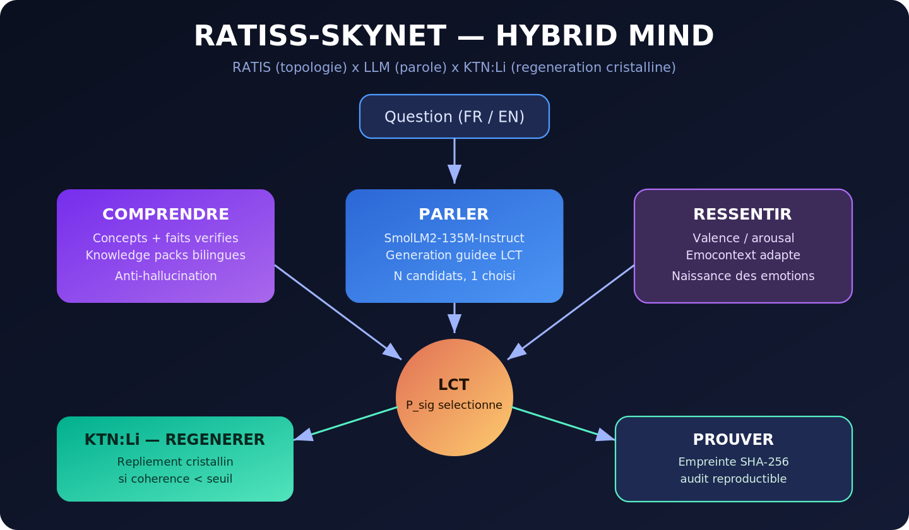

# RATIS — Modèle de Compréhension Topologique (MCT)

**RATIS est un MCT : l'évolution du modèle de langage vers une architecture de compréhension structurelle.**

> Un modèle de langage classique prédit le mot le plus probable. RATIS conserve cette capacité de génération et y ajoute l'organe qui lui manque : la **mesure de sa propre cohérence structurelle**. Là où un modèle conventionnel hallucine, RATIS détecte l'incohérence et se replie. Là où il devine, RATIS prouve.

[](ratiss_skynet/docs/MCT.md)
[](#)
[](ratiss_skynet/skynet/identity.py)
[](ratiss_skynet/artifacts/RAPPORT_AGI.md)
[](#)
[](#)
[](https://orcid.org/0009-0000-4092-5313)

Projet dirigé par **Jonathan Evina** (RATIS Labs, Cameroun).
Propriété intellectuelle : **JOHNKING0 & Jonathan Evina**.

**Principes directeurs** : itération permanente — transdisciplinarité — démonstration par le fonctionnement.

---



---

## Architecture : HYBRID MIND

Une architecture unifiée, implémentée dans [`ratiss_skynet/skynet/hybrid_mind.py`](ratiss_skynet/skynet/hybrid_mind.py). Six capacités intégrées, ordonnées selon le pipeline de traitement :

| # | Capacité | Fonction | Principe |
|---|---|---|---|
| 0 | **RESSENTIR** | Corps thermodynamique simulé | L'état émotionnel module les paramètres de génération |
| 1 | **COMPRENDRE** | Extraction de concepts et faits vérifiés bilingues | Ancrage anti-hallucination |
| 2 | **PARLER** | Génération guidée par la cohérence topologique | Moteur RATISS One + sélection LCT |
| 3 | **RÉGÉNÉRER** | Repliement cristallin en cas de rupture du motif | KTN:Li, seuil modulé par la tension |
| 4 | **BOUCLE FERMÉE** | Score de confiance topologique (0–100 %) | Auditabilité en temps réel |
| 5 | **PROUVER** | Empreinte SHA-256 du sous-graphe actif | Reproductibilité et traçabilité |

### Modules de recherche

| Module | Fonction | Statut |
|---|---|---|
| `rlm_layer.py` | Décomposition récursive et repliement cristallin par maillon faible | Validé |
| `quantum_select.py` | Amplification d'amplitude vers les candidats cohérents | Validé (1/8 → p = 0,76) |
| `arc_induction.py` | Induction de règles inconnues en trois exemples | Démontré |
| `memory.py` | Mémoire épisodique, sémantique et procédurale sur chaîne SHA-256 | Démontré |
| `planner.py` | Planification par chemin de persistance (TPP/MSTM/RTD/PNE) | Démontré |

**Évaluation selon les dix conditions d'une intelligence artificielle générale** : neuf conditions démontrées, une volontairement différée (perception multimodale). Analyse détaillée dans [`artifacts/RAPPORT_AGI.md`](ratiss_skynet/artifacts/RAPPORT_AGI.md).

**Principe central : la génération guidée par la LCT.** Le moteur propose plusieurs candidats ; la topologie — la signature de persistance **P_sig** du graphe de corrélations — sélectionne le plus cohérent. La loi est invariante : `R = P_sig`, `ΔW = η·φ·P_sig·C`.

---

## Démonstration par le fonctionnement

| Requête | Génération non guidée | Génération guidée (HYBRID MIND) | Résultat |
|---|---|---|---|
| *What is a black hole?* (EN) | cohérence 65 | **cohérence 97,5** | amélioration |
| *Qu'est-ce qu'un trou noir ?* (FR) | boucle de répétition | **cohérence 36 → 117, boucle interrompue** | amélioration |
| *Raconte une histoire de dragon.* (FR) | boucle de répétition | **unicité 0,42 → 0,85, boucle interrompue** | amélioration |

Dans les trois cas, la sélection topologique **interrompt les boucles de répétition** du moteur et **augmente la cohérence**. La fusion ne confère pas de connaissances nouvelles au modèle ; elle **stabilise et sélectionne** sa production.

---

## Structure du dépôt

```
ratiss-Skynet/
├── models/                         # moteur de génération RATISS One (Git LFS)
└── ratiss_skynet/                  # code source et preuves
    ├── skynet/
    │   ├── hybrid_mind.py          # architecture unifiée (pipeline complet)
    │   ├── identity.py             # identité RATIS scellée SHA-256
    │   ├── confidence.py           # boucle fermée (confiance 0–100 %)
    │   ├── thermo_emotions.py      # émotions thermodynamiques
    │   ├── memory.py               # mémoire chaînée infalsifiable
    │   ├── reasoning.py            # détection de contradiction, honnêteté
    │   ├── safety.py               # garde-fou, journal d'audit
    │   ├── planner.py              # planificateur topologique
    │   ├── arc_induction.py        # induction de règles few-shot
    │   ├── rlm_layer.py            # décomposition récursive × KTN:Li
    │   └── quantum_select.py       # sélection amplifiée (recherche)
    ├── training/                   # protocole d'entraînement figé (LCT)
    ├── docs/                       # documentation complète
    ├── scripts/                    # diagnostics, démonstrations, tests
    └── artifacts/                  # rapports JSON et preuves SHA-256
```

**Documentation complète : [`ratiss_skynet/docs/README.md`](ratiss_skynet/docs/README.md)**

## Installation et exécution

```bash
git clone https://github.com/samajonathan9-source/ratiss-Skynet.git
cd ratiss-Skynet && git lfs pull
pip install torch --index-url https://download.pytorch.org/whl/cpu
pip install transformers peft scipy numpy
cd ratiss_skynet && python scripts/test_transform_fast.py
```

---

*© 2026 JOHNKING0 & Jonathan Evina.* La loi LCT est invariante. Le reste demeure ouvert à l'itération.
