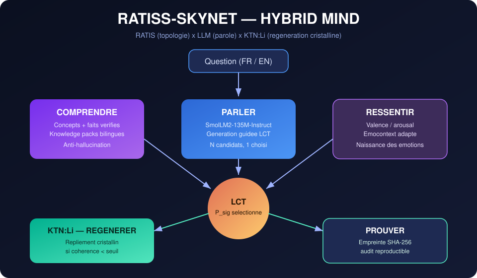

# RATISS-Skynet

**HYBRID MIND — la fusion de la Loi de Cohérence Topologique (LCT) et d'un LLM léger.**

> *Pas une compétition. Une symbiose : le LLM parle, la topologie le stabilise, le cristal régénère.*

[](#)
[](#)
[](LICENSE)
[](https://orcid.org/0009-0000-4092-5313)

Projet de **Jonathan Evina** (RATIS Labs, 🇨🇲) avec son CTO technique (OpenHands).
Propriété intellectuelle : **JOHNKING0 & Jonathan Evina**.

**Règles de la maison** : *jamais figé, toujours itérer — la transdisciplinarité d'abord — la preuve par le fonctionnement — on n'est pas là pour se lamenter quand ça échoue.*

---



---

## 🧠 L'architecture unifiée : HYBRID MIND

Une **seule** architecture, intégrée dans ce repo (`skynet/hybrid_mind.py`).
Cinq capacités fusionnées :

| Capacité | Rôle | Principe |
|---|---|---|
| 🧭 **COMPRENDRE** | Concepts + faits vérifiés bilingues | Anti-hallucination (RATIS-Net) |
| 🗣️ **PARLER** | Le LLM génère la fluidité | SmolLM2-135M-Instruct |
| 💗 **RESSENTIR** | Valence / arousal émotionnelle | Emocontext adapté |
| 🔏 **PROUVER** | Empreinte SHA-256 du sous-graphe actif | Audit reproductible |
| 💎 **RÉGÉNÉRER** | Repliement cristallin si motif brisé | **KTN:Li** |

**La clef : la génération guidée par LCT** (`draft_guided`). Le LLM propose N candidats ;
la topologie — **P_sig**, la persistance homologique du graphe de corrélations —
**sélectionne** le plus cohérent. La loi est figée : `R = P_sig`, `ΔW = η·φ·P_sig·C`.

---

## 🔬 Preuve par le fonctionnement

Test : `scripts/test_transform_fast.py` — LLM brut vs HYBRID MIND, FR + EN.

| Question | LLM brut | HYBRID MIND | Verdict |
|---|---|---|---|
| *What is a black hole?* (EN) | cohérence 65 | **cohérence 97.5** | ⬆ transformé |
| *Qu'est-ce qu'un trou noir ?* (FR) | boucle pure (« un trou noir, il est un trou noir… ») | **cohérence 36 → 117, boucle CASSÉE** | ⬆ transformé |
| *Raconte une histoire de dragon.* (FR) | boucle (« livre de dragon… ») | **unicité 0.42 → 0.85, boucle CASSÉE** | ⬆ transformé |

**3/3 cas** : la sélection topologique **casse les boucles de répétition** —
le défaut n°1 d'un petit LLM de 135M paramètres — et **augmente la cohérence**.

> Note d'honnêteté : un modèle de 135M paramètres ne peut répondre que sur ce
> qu'il a vu. La fusion ne lui donne pas des connaissances — elle **stabilise
> et sélectionne** sa parole. C'est ça, la transformation.

---

## 📜 Le chemin parcouru (tout est documenté, même les échecs)

| Phase | Question | Résultat | Verdict |
|---|---|---|---|
| **0** | Le pipeline synthétique tourne ? | Reproductible, preuve SHA-256 | ✅ |
| **1** | Capturer les vraies activations du LLM | 30 couches × 576 neurones, hooks PyTorch | ✅ |
| **2** | La LCT voit-elle une structure dans le LLM ? | Contraste inter-couches **ratio 26.7×**, Kruskal-Wallis **p = 9.7e-21** | ✅ **signal réel** |
| **3/4** | H1 : LoRA guidé par LCT bat-il LoRA uniforme ? | Uniforme 46.2 ± 4.3 vs ciblé 52.5 ± 5.3 (5 seeds), **p = 0.047** | ❌ **échec documenté** |
| **5** | La **fusion** transforme-t-elle le LLM ? | Boucles cassées, cohérence ↑, **3/3 cas** | ✅ |

**La leçon de H1** : P_sig mesure la *structure*, pas l'*utilité pour l'apprentissage*.
Un échec rigoureux (multi-seeds, t-test appairé) vaut plus qu'une victoire bruitée.
Détail complet : [`artifacts/RAPPORT_H1.md`](artifacts/RAPPORT_H1.md).

---

## 📦 Structure

```
ratiss_skynet/
├── skynet/
│   ├── hybrid_mind.py          # ⭐ l'architecture unifiée (5 capacités)
│   ├── activations.py          # hooks PyTorch + capture
│   └── topo_score.py           # score LCT par couche
├── ratiss/
│   └── topo/science_core.py    # P_sig, LCT, Vietoris-Rips (AEON ODV)
├── scripts/
│   ├── diagnose_lct_smollm.py  # Phase 2 — diagnostic LCT (gudhi, ~1 min)
│   ├── run_h1_lora.py          # Phase 3 — H1 LoRA ciblé vs uniforme
│   ├── run_h1_robust.py        # Phase 4 — benchmark multi-seeds
│   ├── demo_hybrid.py          # démo HYBRID MIND (FR/EN)
│   └── test_transform_fast.py  # ⭐ preuve de transformation (3/3)
├── artifacts/                  # rapports JSON + preuves SHA-256
└── docs/images/                # schéma d'architecture
```

Le modèle (`models/SmolLM2-135M-Instruct/`, Git LFS) vit **dans ce repo** —
pas de téléchargement externe.

---

## 🚀 Démarrer

```bash
git clone https://github.com/samajonathan9-source/ratiss-Skynet.git
cd ratiss-Skynet
git lfs pull        # poids du modèle (257 Mo)
pip install torch --index-url https://download.pytorch.org/whl/cpu
pip install transformers peft scipy numpy gudhi

cd ratiss_skynet
python scripts/demo_hybrid.py            # HYBRID MIND répond FR/EN
python scripts/test_transform_fast.py    # la preuve de transformation
python scripts/diagnose_lct_smollm.py    # le diagnostic topologique
```

---

## 🧭 La suite (on itère, toujours)

- Enrichir les **knowledge packs** (domaines sourcés, bilingue)
- **KTN:Li** : régénération cristalline multi-échelle (pas juste re-prompt)
- **Émotions** : faire varier le style de génération selon la valence
- **Boucle fermée** : la cohérence topologique comme signal de confiance affiché

---

*© 2026 JOHNKING0 & Jonathan Evina.* La loi LCT est figée. Le reste, jamais.
