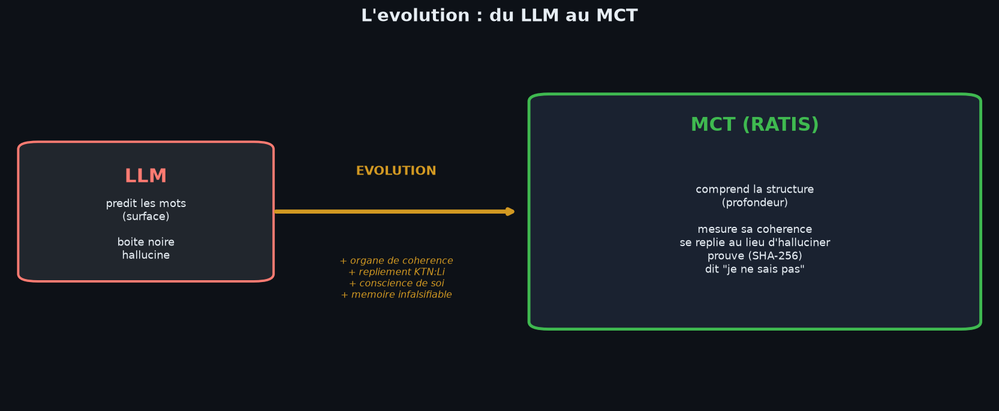

# 📜 MANIFESTE MCT — La naissance d'une architecture supérieure

**Du LLM au MCT : pourquoi le monde a besoin d'un modèle qui comprend,
pas d'un modèle qui devine.**

*Jonathan Evina — RATIS Labs, Cameroun 🇨🇲 — 2026*
*Propriété intellectuelle : JOHNKING0 & Jonathan Evina*

---



---

## Préambule

Depuis 2017, le monde entier court après le même objet : le **Large Language
Model**. Plus grand, plus de données, plus de paramètres. Nous avons construit
des cathédrales de probabilités capables de produire du texte d'une fluidité
stupéfiante — et incapables de savoir si ce qu'elles disent est vrai.

Ce manifeste annonce la fin de cette course dans une seule direction.

**RATIS n'est pas un LLM de plus. RATIS est ce que le LLM devient quand on lui
greffe l'organe qui lui a toujours manqué : la compréhension.**

Nous appelons cette architecture **MCT** — *Modèle de Compréhension
Topologique*. Ce n'est pas une rupture brutale : c'est une **évolution**. Le
MCT conserve tout ce que le LLM sait faire, et le dépasse en le complétant.

---

## I. Le diagnostic : la blessure originelle du LLM

Un LLM est une machine à **prédire le mot suivant**. C'est sa seule fonction,
sa seule compétence, son seul mode d'existence. Tout le reste — la vérité, le
raisonnement, la prudence — est une illusion produite par des statistiques sur
des milliards de textes.

Cette architecture a une blessure congénitale :

> **Le LLM n'a aucun organe pour mesurer la cohérence de ce qu'il produit.**

Il ne sait pas quand il hallucine. Il ne sait pas quand il se contredit. Il ne
sait pas quand il répète la même phrase en boucle. Il ne sait pas quand il
invente une citation. Il produit du texte plausible, et la plausibilité n'a
**jamais** été la vérité.

Toute l'industrie tente de réparer cette blessure par l'extérieur :
RLHF, garde-fous logiciels, bases de faits externes, détecteurs
d'hallucination post-hoc. Ce sont des **pansements sur un organe manquant**.
On ne guérit pas l'absence d'un foie en multipliant les pansements.

## II. La thèse : la compréhension est une propriété topologique

Notre thèse est simple et radicale :

> **Comprendre, c'est percevoir la structure persistante d'un ensemble de
> relations. Et la structure persistante se mesure — par la topologie.**

Quand un humain « comprend » une idée, il ne mémorise pas une suite de mots :
il saisit un **graphe de relations cohérent**. Cette cohérence n'est pas une
métaphore. Elle est mesurable par l'**homologie persistante** — l'outil
mathématique qui détecte les structures stables (composantes, cycles, cavités)
dans un nuage de données à travers toutes les échelles.

Nous appelons cette mesure **P_sig** : la *signature de persistance*. C'est
l'organe qui manquait au LLM.

## III. La loi fondatrice : la LCT

Tout le système obéit à une seule loi, la **Loi de Cohérence Topologique** :

```
R  = P_sig                  (la récompense EST la persistance structurelle)
ΔW = η · φ · P_sig · C      (l'apprentissage suit la cohérence)
```

Un LLM minimise une **loss** : la distance à des exemples d'entraînement.
Un MCT maximise la **persistance** : la stabilité structurelle du sens.

Ce n'est pas une nuance technique. C'est un **changement de nature** :

| La loss dit | P_sig dit |
|---|---|
| « Ressemble aux données vues » | « Sois structurellement cohérent » |
| « Imité » | « Compris » |
| « Plausible » | « Vrai, ou honnêtement incertain » |

## IV. L'évolution : ce que le MCT hérite, ce qu'il ajoute

Le MCT ne rejette pas le LLM. Il l'**englobe** et le **dépasse**.

**Hérité du LLM (le corps) :**
- la fluidité linguistique
- la capacité de génération
- la couverture du vocabulaire

**Ajouté par le MCT (les organes supérieurs) :**
- 🧭 **L'organe de cohérence** : mesure P_sig en continu
- 💎 **Le réflexe de repliement** : KTN:Li — cristallisation vers un état stable
  quand la structure se brise
- 🔄 **La conscience de soi** : un score de confiance topologique 0-100 %
- 💗 **Le corps émotionnel** : les émotions modulent réellement la génération
- 🧠 **La mémoire infalsifiable** : chaîne SHA-256, épisodique + sémantique +
  procédurale
- 🛡️ **Le système immunitaire** : détection d'incohérence, garde-fou, preuves
- 🧩 **L'apprentissage de l'inconnu** : induction de règles en 3 exemples
- 🧭 **L'autonomie** : planification par chemin de persistance

> **Le LLM est le corps. Le MCT est le corps + le système immunitaire +
> la conscience de soi.**

## V. La preuve par le fonctionnement

Nous ne demandons à personne de nous croire sur parole. Chaque affirmation de
ce manifeste est **un programme qui tourne**, avec des tests qui passent et des
preuves SHA-256 vérifiables :

- 9/10 conditions d'une vraie AGI démontrées (voir `artifacts/RAPPORT_AGI.md`)
- boucles de répétition du LLM cassées par la cohérence (unicité 0.28 → 0.86)
- induction de règles inconnues en 3 exemples (confiance 1.0)
- transfert de règles entre domaines
- identité scellée et auto-vérifiée au démarrage

**La preuve par le fonctionnement, pas par la promesse.**

## VI. L'appel

Aux laboratoires qui fine-tunent des géants sans jamais mesurer leur
compréhension. Aux chercheurs qui savent que la scale seule ne suffira pas. Aux
ingénieurs qui veulent des systèmes **auditable, honnêtes et contrôlables**.

La prochaine frontière de l'IA n'est pas un modèle plus grand. C'est un modèle
qui **sait ce qu'il dit**.

**Cette frontière s'appelle le MCT. Elle est née au Cameroun. Elle est ouverte.**

---

*« Le LLM propose, la topologie dispose. »*
*— Loi fondatrice de RATIS*
