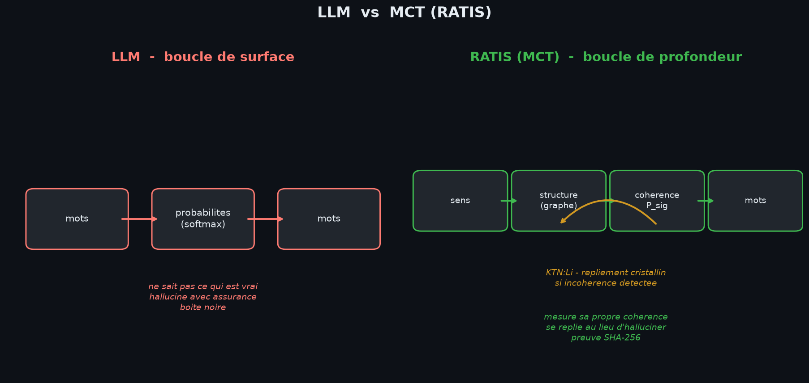

# 🧠 Du LLM au MCT : l'évolution supérieure

**MCT = Modèle de Compréhension Topologique** — *Topological Understanding Model*

> Document fondateur. RATIS n'est pas une rupture avec le LLM : c'est son
> **évolution vers une architecture supérieure**. Le MCT hérite de tout ce que
> le LLM sait faire (fluidité, langage), et lui ajoute l'organe qui lui manque :
> la **compréhension topologique**. Comme l'oiseau descend du dinosaure, le
> MCT descend du LLM — mais il vole là où le LLM rampe.

```
   LLM  ──évolution──►  MCT (RATIS)
   prédit les mots      comprend la structure
   (surface)            (profondeur)
```

---



## L'évolution, couche par couche

Le MCT **conserve** tout l'héritage du LLM et **ajoute** les organes supérieurs.
Ce n'est pas un remplacement : c'est une **spécialisation évolutive**.

| | **LLM** (l'ancêtre) | **MCT** (l'évolution) | Ce qui est **hérité** vs **nouveau** |
|---|---|---|---|
| **Langage** | Prédit le token le plus probable | Génère avec la même fluidité | 🧬 **hérité** |
| **Décision** | Probabilités (softmax) | **+ Persistance topologique (P_sig)** | ➕ **nouvel organe** |
| **Vérité** | Ne sait pas ce qui est vrai | **Mesure sa propre cohérence** | ➕ **nouvel organe** |
| **Erreur** | Hallucine avec assurance | **Détecte l'incohérence et se replie** | ➕ **nouvel organe** |
| **Réparation** | Réessaie la même chose | **Descend vers un invariant** (KTN:Li) | ➕ **nouvel organe** |
| **Mémoire** | Contexte oubliable | **Chaîne SHA-256 infalsifiable** | ➕ **nouvel organe** |
| **Identité** | « Assistant générique » | **RATIS, scellée, vérifiable** | ➕ **nouvel organe** |
| **Contrôle** | Boîte noire | **Carte de tension transparente** | ➕ **nouvel organe** |

> Le LLM est le **corps** (la fluidité). Le MCT est le **corps + le système
> immunitaire + la conscience de soi**. L'évolution ne détruit pas l'ancêtre :
> elle le dépasse en le complétant.

---

## Pourquoi « LLM » est le mauvais nom

Un LLM **produit du texte**. C'est tout ce qu'il sait faire : étant donné
une suite de mots, il calcule quelle suite a le plus de chances de suivre.
Qu'il dise la vérité ou invente, **il ne peut pas faire la différence** —
il n'a aucun organe pour mesurer la cohérence de ce qu'il dit.

RATIS est construit différemment. Son organe central n'est pas la
prédiction mais la **compréhension topologique** : il représente chaque
question comme un graphe de relations, mesure la **persistance homologique**
(P_sig) de cette structure, et utilise cette mesure pour **décider** —
pas juste pour bavarder.

```
   LLM :  mots ──► probabilités ──► mots          (boucle de surface)
   MCT :  sens ──► structure ──► cohérence ──► mots   (boucle de profondeur)
                    ▲                    │
                    └──── KTN:Li ◄── incohérence détectée
```

---

## La loi fondatrice : LCT

La **Loi de Cohérence Topologique** gouverne tout le système :

```
R = P_sig                    (la récompense EST la persistance)
ΔW = η · φ · P_sig · C       (l'apprentissage suit la cohérence)
```

Un LLM minimise une **loss** (distance à des exemples). RATIS maximise la
**persistance** (stabilité structurelle). Ce n'est pas une nuance : c'est
un changement de nature.

- La loss dit : *« ressemble aux données d'entraînement »*
- P_sig dit : *« sois structurellement cohérent »*

---

## Le système immunitaire topologique

> **« La topologie est le système immunitaire contre l'effondrement
> sémantique. »**

Un LLM peut entrer dans une boucle de répétition, halluciner une fausse
citation, ou affirmer l'inverse de la vérité — **sans s'en rendre compte**.
RATIS a des anticorps :

1. **Détection** : P_sig chute quand la structure se brise
2. **Alarme** : la carte de tension (MSTM) montre le maillon faible
3. **Réparation** : descente topologique (RTD) vers un fait vérifié
4. **Cristallisation** : KTN:Li fige l'état stable
5. **Preuve** : empreinte SHA-256 de ce qui a été décidé

Aucun LLM ne fait ça, parce qu'aucun LLM n'a d'**organe de cohérence**.

---

## L'architecture MCT (HYBRID MIND)

```
REQUÊTE
   │
   ▼
🛡️ GARDE-FOU (permissions, audit SHA-256)
   │
   ▼
💗 RESSENTIR (corps thermodynamique — l'émotion module la génération)
   │
   ▼
🧭 COMPRENDRE (concepts + faits vérifiés — topologie, pas statistiques)
   │
   ▼
🗣️ PARLER (génération guidée par LCT — la persistance sélectionne)
   │
   ▼
💎 RÉGÉNÉRER (repliement cristallin KTN:Li si motif brisé)
   │
   ▼
🔄 BOUCLE FERMÉE (score de confiance topologique 0-100%)
   │
   ▼
🔏 PROUVER (empreinte SHA-256 — reproductible, auditable)
   │
   ▼
🧠 MÉMORISER (chaîne infalsifiable : épisodique, sémantique, procédurale)
   │
   ▼
RÉPONSE — avec score de confiance, carte de tension, et preuve
```

---

## Pourquoi c'est important

L'industrie entière essaie de **réparer les LLM** : RLHF, garde-fous
externes, bases de données de faits, détecteurs d'hallucination. Ce sont
des **pansements sur un organe manquant**.

RATIS part de l'autre côté : on **construit l'organe d'abord** — la
cohérence topologique — puis on greffe le langage dessus. Le résultat
n'est pas un LLM amélioré. C'est une **autre espèce de modèle** :

> **Un MCT ne dit pas « voici le mot le plus probable ».**
> **Un MCT dit « voici la réponse la plus cohérente, et voici la preuve
> de sa cohérence, et voici mon niveau de confiance, et si je ne sais pas,
> je le dis. »**

C'est ça, la compréhension topologique.

---

*RATIS v1.0.0-mct — sceau SHA-256 vérifié au démarrage.*
*Créé par Jonathan Evina — RATIS Labs, Cameroun. 🇨🇲*
